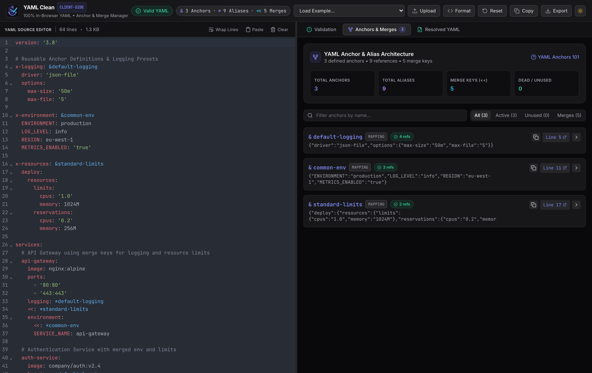
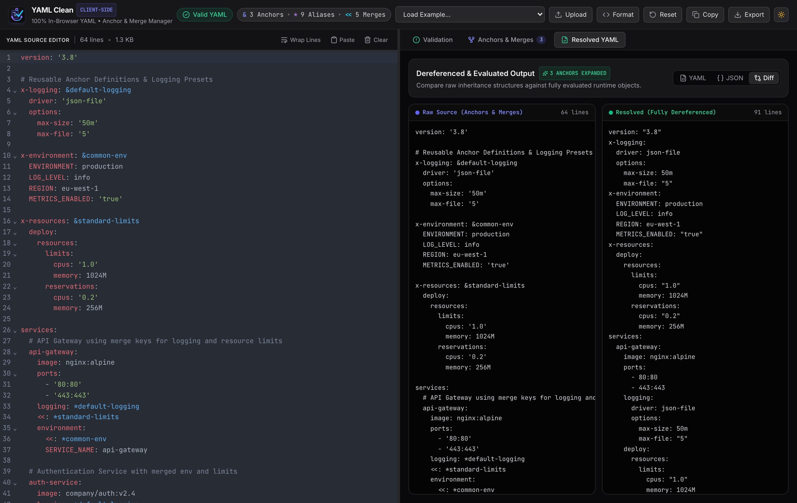
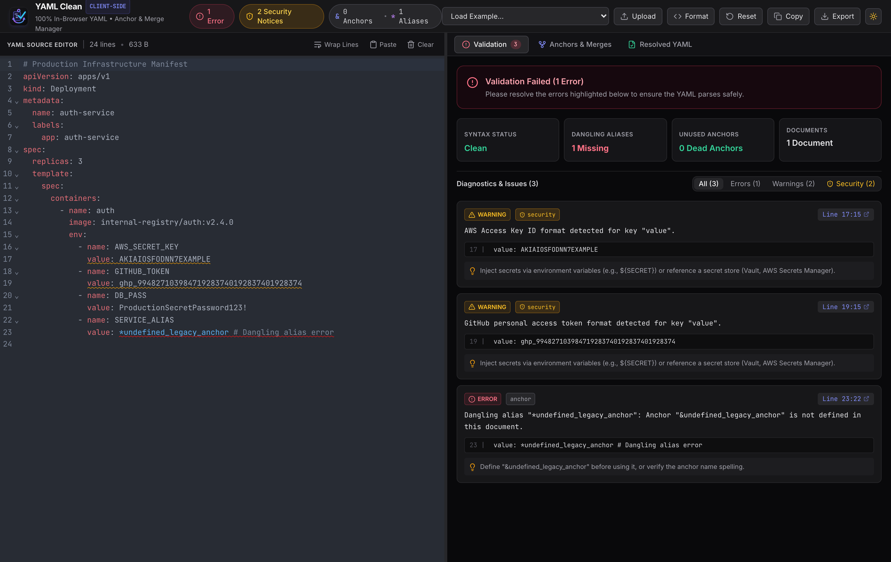

# YAML Clean • In-Browser YAML Validator & Anchor Manager

[](https://github.com/smford/yaml-web-validator/actions/workflows/ci.yml)
[](https://github.com/smford/yaml-web-validator/actions/workflows/release.yml)
[](https://github.com/smford/yaml-web-validator/actions/workflows/deploy.yml)
[](https://github.com/smford/yaml-web-validator)

A modern, client-side YAML IDE built for DevOps, SREs, and developers to manage complex YAML anchors (`&`), aliases (`*`), and merge keys (`<<`), scan for plaintext secrets, and inspect real-time dereferenced diffs—all 100% in-browser with zero telemetry.

<p align="center">
  
</p>

---

## Key Features

### 1. 100% Client-Side In-Browser Processing & Offline PWA
- **Zero Server Latency & 100% Privacy**: All parsing, AST traversal, anchor dereferencing, and validation occur locally in browser memory.
- **Air-Gapped Ready (PWA)**: Includes Service Worker caching and Web App Manifest for standalone desktop installation and complete offline functionality.
- **Session Auto-Save**: Seamlessly preserves editor drafts in `localStorage` across page refreshes.

### 2. Advanced Anchor (`&`), Alias (`*`), and Merge Key (`<<`) Management
- **Anchor Inventory**: Catalogs defined anchors (`&name`), node types (mapping, sequence, scalar), line numbers, and live content previews.
- **Usage Metrics & Reverse Cross-References**: Tracks alias references (`*name`) across files with one-click line jumps.
- **Merge Key (`<<`) Support**: Full support for YAML merge keys (`<<: *anchor` and `<<: [*a, *b]`), displaying inherited structures.
- **Dead Code & Dangling Reference Detection**: Highlights unused anchors and flags dangling aliases as errors.

### 3. Side-by-Side Visual Diff & Resolved Exports
- **Real-Time Visual Diff**: Compare raw inheritance YAML against fully dereferenced, evaluated output side-by-side.
- **Multi-Format Export**: Export clean, dereferenced YAML or evaluated JSON ready for CI/CD pipelines.

<p align="center">
  
</p>

### 4. Shift-Left Security & Plaintext Secret Scanner
- **Credential Detection**: Automatically identifies accidentally committed AWS keys, GitHub PATs, private keys, database passwords, and bearer tokens.
- **Remediation Hints**: Contextual advice on migrating to environment variables or secret vaults.

### 5. In-Editor Inline Linter & Diagnostics
- **Live Squigglies & Gutter Markers**: Powered by `@codemirror/lint` with tooltip explanations and one-click line navigation.
- **Multi-Document Streams**: Full support for multi-document YAML files separated by `---` (such as Kubernetes manifests and Helm charts).

<p align="center">
  
</p>

---

## Tech Stack

- **Language**: [TypeScript](https://www.typescriptlang.org/) (Strict mode)
- **Framework**: [React 18](https://react.dev/) + [Vite 6](https://vite.dev/)
- **Styling**: [Tailwind CSS](https://tailwindcss.com/) (Modern dark/light developer theme)
- **Editor**: [CodeMirror 6](https://codemirror.net/) with `@codemirror/lang-yaml`
- **YAML Engine**: [`yaml`](https://eemeli.org/yaml/) (YAML 1.2 & 1.1 merge keys with CST/AST traversal)
- **Testing**: [Vitest](https://vitest.dev/)
- **CI/CD & Automation**: GitHub Actions (Lint, Test, Build, GitHub Pages deployment, Semantic Release) & Dependabot

---

## Local Development

### Prerequisites
- Node.js 18+ or 20+
- npm 9+

### Quick Start
```bash
# 1. Clone the repository
git clone git@github.com:smford/yaml-web-validator.git
cd yaml-web-validator

# 2. Install dependencies
npm install

# 3. Start local development server
npm run dev
```
Open `http://localhost:5173` in your browser.

### Running Tests & Quality Checks
```bash
# Run unit test suite (Vitest)
npm run test

# Typecheck and lint
npm run lint

# Build production bundle
npm run build

# Preview production build locally
npm run preview
```

---

## Semantic Versioning & Releases

This project uses [Semantic Release](https://github.com/semantic-release/semantic-release) and adheres to [Conventional Commits](https://www.conventionalcommits.org/).

When a pull request is merged into `main`, GitHub Actions automatically:
1. Determines the next semantic version number based on commit messages:
   - `fix:` / `perf:` / `refactor:` -> **Patch** (`v1.0.X`)
   - `feat:` -> **Minor** (`v1.X.0`)
   - `BREAKING CHANGE:` -> **Major** (`vX.0.0`)
2. Updates `CHANGELOG.md` with categorized release notes.
3. Bumps version in `package.json` and `package-lock.json`.
4. Creates a Git tag and publishes a **GitHub Release**.
5. Packages and attaches the production bundle (`release-dist.zip`) directly to the GitHub release assets.

---

## License

This project is open-source software licensed under the [GNU Affero General Public License v3.0 (AGPLv3)](./LICENSE).
